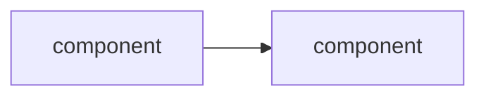

<!--
PR テンプレート — 不要なセクションは削除してください。
レビュー観点と運用ルールは CLAUDE.md / docs/conventions.md / .claude/rules/ を参照。
-->

## Summary

<!-- 1〜3 行で。WHAT (何を変えたか) と WHY (なぜ) を簡潔に。-->

## Changes

<!-- 主要な変更点を箇条書きで。論理単位ごとにコミットを分けるのが理想。-->

-

## 構造図 (任意)

<!--
複数コンポーネントが絡む変更は Mermaid で図示すると review が早い。
不要なら削除してください。

-->

## Test plan

<!-- どう動作確認したか / これから何をするか。チェックリストで。-->

- [ ] `go test ./...` PASS
- [ ] `gofmt -l ./...` 空
- [ ] α 統合テスト PASS (該当する場合)
- [ ] 手動動作確認 (該当する場合): どこを、どんな手順で

## 関連

<!-- 関連 issue / phase 設計ドキュメント / 過去の review コメント等 -->

- Phase: <!-- 例) phase-5-8 -->
- Closes: <!-- 例) #123 -->

## Checklist

- [ ] DESIGN.md の「やらない」リストに該当する変更を含んでいない
- [ ] 公開 API / 設定スキーマの変更がある場合は `docs/` を更新した
- [ ] 新規依存を追加した場合、`go.mod` / 本 PR description に判断理由を書いた
- [ ] CHANGELOG.md `[Unreleased]` に記載した (該当する場合)
