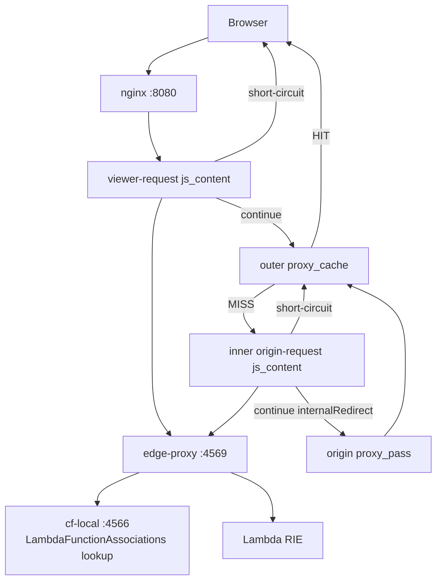

# Lambda@Edge in cf-local

cf-local は CloudFront 配下で動く Lambda@Edge ハンドラを **AWS 公式 Lambda Runtime Interface Emulator (RIE)** 経由でローカル実行する仕組みを持つ。Phase 4-E 時点の working set は **viewer-request + origin-request** の request hooks まで。`origin-response` / `viewer-response` は Phase 4-F で扱う。

このドキュメントは:

- 全体構成図と各コンポーネントの責務
- 設定方法 (Terraform / docker-compose)
- viewer-request / origin-request の return 仕様
- 制限と既知の差分

を扱う。制限詳細は [`docs/limitations.md`](./limitations.md#lambdaedge--cloudfront-functions) も参照。

## 全体構成



各コンポーネントの責務:

| コンポーネント | 担当 |
|---|---|
| **nginx + njs (`edge.js`)** | request snapshot を edge-proxy に POST、応答に応じて short-circuit / continue / fail-open を選択 |
| **edge-proxy (Go)** | CloudFront event の構築、RIE invoke、Lambda return の翻訳。本物 CloudFront でいう edge 実行コンテナの役割 |
| **cf-local control plane** | distribution の `LambdaFunctionAssociations` を BoltDB に永続化、edge-proxy の lookup 要求に応答 |
| **Lambda RIE** | AWS 公式 Lambda 実行エミュレータ。Lambda コードをそのまま動かす |

## 設定方法

### 1. Lambda 関数を docker-compose で立てる

cf-local は Lambda 関数の CRUD API は実装しない。docker-compose で AWS 公式 RIE コンテナを立てる:

```yaml
services:
  lambda-auth:
    image: public.ecr.aws/lambda/nodejs:20
    command: ["index.handler"]
    volumes:
      - ./lambdas/auth:/var/task:ro

  lambda-origin-rewrite:
    image: public.ecr.aws/lambda/nodejs:20
    command: ["index.handler"]
    volumes:
      - ./lambdas/origin-rewrite:/var/task:ro
```

`/var/task/index.js` を含むディレクトリを volume mount する。RIE は内部 `:8080` で listen する。

### 2. cf-local に関数 ARN → RIE endpoint のマッピングを渡す

`CF_LOCAL_LAMBDA_FUNCTIONS` 環境変数で、Lambda 関数名と RIE コンテナ host:port を結びつける:

```yaml
services:
  cf-local:
    environment:
      CF_LOCAL_EDGE_PROXY: http://edge-proxy:4569
      CF_LOCAL_LAMBDA_FUNCTIONS: |
        auth=lambda-auth:8080
        origin-rewrite=lambda-origin-rewrite:8080
```

Lambda 関数 ARN は CloudFront で使われる verbatim 文字列 (`arn:aws:lambda:us-east-1:000000000000:function:auth:1`) のうち、関数名セグメントが抽出され、上記 env で RIE endpoint に解決される。

シンタックス:

- 1 行に 1 entry / または `,` / `;` 区切り
- 値の host:port は scheme 省略可 (自動で `http://` が付く)
- `#` 始まりの行と空行は無視
- malformed line は warn ログ出力で skip (cf-local 起動は止めない)

### 3. Distribution に LambdaFunctionAssociation を attach

Terraform 例:

```hcl
resource "aws_cloudfront_distribution" "main" {
  # ...
  default_cache_behavior {
    target_origin_id       = "app"
    viewer_protocol_policy = "allow-all"
    cache_policy_id        = aws_cloudfront_cache_policy.default.id

    lambda_function_association {
      event_type   = "viewer-request"
      lambda_arn   = "arn:aws:lambda:us-east-1:000000000000:function:auth:1"
      include_body = false
    }

    lambda_function_association {
      event_type   = "origin-request"
      lambda_arn   = "arn:aws:lambda:us-east-1:000000000000:function:origin-rewrite:1"
      include_body = false
    }
  }
}
```

`terraform apply` 後、cf-local の renderer が:

- viewer-request association を持つ behavior の outer location を `js_content edge.runViewerRequest;` にする
- origin-request association を持つ behavior の cache MISS 経路を inner-hop `js_content edge.runOriginRequest;` にする
- continue 時は `internalRedirect` で forward/origin location に進める
- Lambda runtime error / sidecar 到達不能時は fail-open で通常 forward/origin 経路へ進める

file-based loader (`./cf-local/distributions/*.json`) で起動した distribution は DistributionID が空のため Lambda@Edge bridge は無効化される。LambdaFunctionAssociation を使う場合は AWS API 経由 (Terraform / aws CLI) で登録すること。

完全な Phase 4-E 動作例は [`examples/lambda-edge-full/`](../examples/lambda-edge-full/) を参照。viewer-request だけの最小例は [`examples/lambda-edge-basic/`](../examples/lambda-edge-basic/) に残している。

## viewer-request

viewer-request は cache lookup 前に毎回発火する。cache HIT でも認証や URL rewrite を実行したい用途に使う。

### request 改変 (continue)

```js
exports.handler = async (event) => {
    const request = event.Records[0].cf.request;
    request.uri = '/new-path';
    request.querystring = 'tracing=on';
    return request;
};
```

cf-local は URI / querystring の変更を `internalRedirect()` 経由で nginx に反映し、後段の cache/origin 経路へ進む。

### short-circuit response

```js
exports.handler = async () => {
    return {
        status: '302',
        statusDescription: 'Found',
        headers: {
            location: [{ key: 'Location', value: 'https://login.example.com/' }],
        },
    };
};
```

cf-local は origin に到達せず、nginx から直接 302 を返す。`body` を含めれば任意のボディも返せる (`bodyEncoding: 'base64'` で base64 デコード対応)。

## origin-request

origin-request は cache MISS 時だけ、origin への接続直前に発火する。Phase 4-E では `nginx/spike/origin-request/README.md` の Option 2 に基づき、inner hop を `js_content` 化している。

```text
outer cache hop
  proxy_cache
  proxy_pass inner
      |
      v
inner-A
  js_content edge.runOriginRequest
  ngx.fetch edge-proxy /invoke
  internalRedirect @origin on continue/fail-open
      |
      v
inner-B @origin
  proxy_pass origin
```

この topology により:

- cache HIT では origin-request は発火しない
- cache MISS では origin 接続前に `ngx.fetch` で edge-proxy/RIE を呼ぶ
- Lambda が request を返すと URI / querystring 改変を反映して origin へ進む
- Lambda が response を返すと origin へ行かず short-circuit する
- Lambda runtime error / sidecar 到達不能時は fail-open で origin へ進む

origin-request continue 例:

```js
exports.handler = (event, context, callback) => {
    const request = event.Records[0].cf.request;
    if (request.uri === '/old-path') {
        request.uri = '/new-path';
    }
    request.querystring = request.querystring
        ? request.querystring + '&origin_rewrite=1'
        : 'origin_rewrite=1';
    callback(null, request);
};
```

## 制約

Phase 4-E で確定している主な制約:

| 項目 | 制限 | 対応積みタスク |
|---|---|---|
| 4 フック | viewer-request + origin-request まで。origin-response / viewer-response は Phase 4-F | `BL-LE1` 部分解消 |
| `include_body: true` | 未対応 (request body は Lambda に渡らない) | `BL-LE2` |
| request header 改変 | viewer-request / origin-request とも origin に反映されない | `BL-LE5` |
| request method 改変 | 反映されない | `BL-LE6` |
| dynamic origin selection | origin-request event の `request.origin` object は省略。origin 差し替え非対応 (F3=B) | `BL-LE8` |
| CloudFront Functions | 未対応 | `BL-CFF1` |

B1-B3 由来の制約:

- **B1**: nginx `js_header_filter` / `js_body_filter` は同期専用で `ngx.fetch` を呼べない。Lambda@Edge response hooks は filter 発火では実装しない。
- **B2**: origin-response の cache-write は outer `proxy_cache` の前に inner hop で改変を済ませる必要がある。Phase 4-F の検討事項で、`BL-LE-Cache1` に積む。
- **B3**: AWS Lambda@Edge の origin-response trigger は origin body を露出しない。body 読取による書き換えは AWS でも不可で、生成 / 削除のみが検討対象。

## トラブルシューティング

### Lambda が呼ばれない

- `docker logs <edge-proxy container>` を確認。`edge_proxy_lookup_failed` が出ていれば cf-local control plane に到達できていない。
- `edge_proxy_missing_rie_endpoint` が出ていれば `CF_LOCAL_LAMBDA_FUNCTIONS` の name 部と Lambda 関数 ARN の name セグメントが一致していない可能性。
- file-based loader で登録した distribution では Lambda@Edge bridge は有効化されない。Terraform / aws CLI で API 登録すること。
- origin-request は cache MISS 時のみ発火する。同じ cache key の 2 回目以降は HIT なら呼ばれない。

### Lambda コードを更新したのに反映されない

Lambda 関数のコードは volume mount している (`/var/task:ro`)。コード自体の更新は live reflected されるが、Node.js の require cache が効くハンドラだと再起動が必要なケースがある:

```bash
docker compose -f examples/lambda-edge-full/docker-compose.yml restart lambda-auth lambda-origin-rewrite
```

## 参考資料

- [AWS Docs: Lambda@Edge event structure](https://docs.aws.amazon.com/AmazonCloudFront/latest/DeveloperGuide/lambda-event-structure.html)
- [AWS Lambda Runtime Interface Emulator](https://github.com/aws/aws-lambda-runtime-interface-emulator)
- [`nginx/spike/origin-request/README.md`](../nginx/spike/origin-request/README.md) — origin-request inner-hop topology spike
- [DESIGN.md §3.5 / §3.6](../DESIGN.md) — cf-local の Lambda@Edge アーキテクチャ判断
