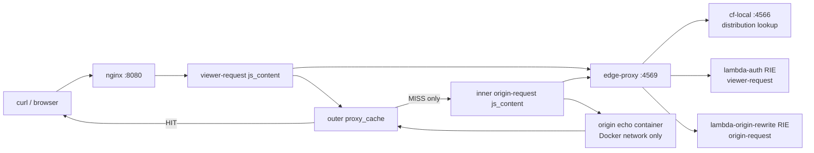

# Lambda@Edge full example (phase-4e)

cf-local の Phase 4-E working set、つまり **viewer-request + origin-request**
の request hooks をローカルで動かす自己完結サンプル。

origin-response / viewer-response は Phase 4-F で追加する。この example には
response hooks 用の Lambda や association は含めない。

## 構成



Services are defined in [`docker-compose.yml`](./docker-compose.yml):

| Service | Role | Host port |
|---|---|---|
| `cf-local` | AWS API compatible control plane and nginx renderer | `:4566` |
| `nginx` | data plane | `:8080` |
| `edge-proxy` | Lambda@Edge sidecar invoked by njs | `:4569` |
| `lambda-auth` | AWS Lambda RIE for viewer-request | internal `:8080` |
| `lambda-origin-rewrite` | AWS Lambda RIE for origin-request | internal `:8080` |
| `origin` | echo origin used only inside Docker | none |

The origin is intentionally a Docker service, not `host.docker.internal:3000`.

## 起動

Run from the repository root:

```bash
docker compose -f examples/lambda-edge-full/docker-compose.yml up --build -d
```

Register the distribution through the cf-local CloudFront API. File-mode config
does not enable LambdaFunctionAssociation because the renderer needs an API
distribution ID.

```bash
cd examples/lambda-edge-full
terraform init
terraform apply
```

The Terraform provider endpoint is fixed to `http://localhost:4566`.

## 動作確認

```bash
# viewer-request: missing Authorization short-circuits.
curl -i http://localhost:8080/foo

# viewer-request: bypass query continues without auth.
curl -i 'http://localhost:8080/foo?bypass=1'

# viewer-request: auth continues and /old-path is rewritten to /new-path.
curl -i -H 'Authorization: Bearer x' http://localhost:8080/old-path

# origin-request: cache MISS invokes origin-rewrite and rewrites /origin-old.
curl -i -H 'Authorization: Bearer x' http://localhost:8080/origin-old

# origin-request fires only on MISS. A repeated request for the same cache key
# should be served from cache without invoking lambda-origin-rewrite again.
curl -i -H 'Authorization: Bearer x' http://localhost:8080/origin-old
```

The echo origin response should show the URI/query received by the origin. For
`/origin-old`, the origin-request Lambda changes the request to `/origin-new`
and adds `origin_rewrite=1` to the query string before continuing.

## Lambda handlers

`lambdas/auth/index.js` is the viewer-request handler:

- `?bypass=1` continues without changes
- missing `Authorization` returns a 401 response without reaching origin
- authorized requests add `X-Authed-By: cf-local-auth`
- `/old-path` is rewritten to `/new-path`

`lambdas/origin-rewrite/index.js` is the origin-request handler:

- receives `event.Records[0].cf.request`
- rewrites `/origin-old` to `/origin-new`
- adds `origin_rewrite=1` to `request.querystring`
- calls `callback(null, request)` so the request continues to origin

## Known limitations

Phase 4-E covers request hooks only:

- `viewer-request` fires before cache lookup.
- `origin-request` fires only on cache MISS, in the inner-hop `js_content`
  topology validated by `nginx/spike/origin-request/README.md`.
- `origin-response` and `viewer-response` are Phase 4-F work.

Origin-request currently follows F3=B from the phase plan: cf-local omits the
CloudFront `request.origin` object, so dynamic origin selection is not
supported. Use uri/querystring rewrite and short-circuit examples only. See
`docs/limitations.md` for the corresponding backlog item.
